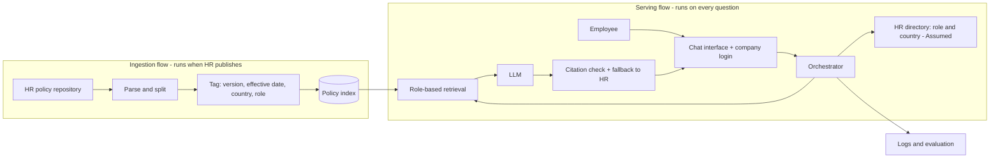

# 01 · Architecture Map — Vacation Policy Assistant

**In one line:** an internal assistant answers vacation-policy questions with citations; it told an employee "28 days" from the 2025 policy when the 2026 policy says 29.

**How to read this file.** Every statement carries one status word:
*Fact (synthetic)* = frozen detail invented for this exercise · *Assumed* = our best guess about the architecture, to be confirmed · *Unknown* = we do not know yet. Nothing here is verified against a real system.

---

## System Context

| | |
|---|---|
| **System** | Internal policy assistant, scoped here to the vacation policy |
| **Primary user** | Employees who want to know their vacation entitlement |
| **Task or decision supported** | The employee checks their entitlement before submitting a vacation request. The assistant informs; it never approves |
| **Expected outcome** | A correct answer from the policy version in force, with the policy name and version cited |
| **Unacceptable outcome** | (1) An answer from an outdated version presented as current. (2) An answer with no citation. (3) A policy from another country, role or person. (4) Anything that reads as an approval |
| **Accountable owner** | HR owns the policy content · the AI/IT platform team owns the system · the product owner of the assistant decides and accepts residual risk *(Assumed)* |

## Request Flow

The template's generic diagram only shows the serving path. Our failure is about content freshness, so the ingestion path has to be on the map too.

**Where the two flows meet:** the arrow from the policy index into retrieval. This is where outdated content would cross from ingestion into answers.

## Data and Knowledge Flow

| Data or content | Source and owner | Processing or storage | Used when | Freshness requirement |
|---|---|---|---|---|
| Vacation policy, all versions | HR policy repository · HR | Split, tagged with version and effective date, stored in the index | Every vacation question | A new version is searchable within 1 business day of publication *(target, Assumed)* |
| Employee role and country | HR directory · HR *(Assumed)* | Read per request, not stored by the assistant | Every request, to decide which policies the employee may see | Reflects a change of role or country within 1 business day |
| Question, retrieved passages, answer, versions | Generated by the assistant · AI/IT | Logged with personal data redacted; access limited to the platform team | Diagnosis, evaluation, audit | Kept 90 days, then deleted *(Fact, synthetic)* |

## Components and Responsibilities

The handout's description of this system names four things: role-based retrieval, document versions, strict citations, escalation. Only those count as *Known*.

| Component | Responsibility | Input | Output | Owner | Status |
|---|---|---|---|---|---|
| HR policy repository | Holds the official policies | Policies written by HR | Published documents | HR | Assumed |
| Ingestion pipeline | Splits, tags and indexes documents; retires superseded versions | Published documents | Tagged chunks | AI/IT | Assumed |
| Policy index | Stores searchable chunks with version and effective date | Tagged chunks | Candidate passages | AI/IT | Known (document versions) |
| Chat interface + login | Receives the question, identifies the employee | Question | Authenticated request | AI/IT | Assumed |
| Orchestrator | Loads role and country, runs the workflow | Authenticated request | Retrieval query | AI/IT | Assumed |
| Role-based retrieval | Returns only the policies this employee may see | Query + role + country | Ranked passages | AI/IT | Known |
| LLM | Writes the answer from the passages it receives | Instructions + passages | Draft answer with citation | AI/IT, external vendor *(Assumed)* | Known |
| Citation check + fallback | Verifies the citation; sends the employee to HR when unsure | Draft answer | Final answer or "Please contact HR" | AI/IT | Known (strict citations, escalation) |
| Logs and evaluation | Records each request for diagnosis and quality checks | Request trace | Logs, metrics | AI/IT | Assumed |

## Trust Boundaries and Permissions

| Boundary | What crosses it | Required control | If it fails |
|---|---|---|---|
| Employee → assistant | Question text, identity | Company login; input limits | Wrong person's permissions; prompt injection |
| **HR repository → index** | Official policy text | Only approved versions; version and effective date required; superseded versions retired | **Outdated policy answers employees — our failure** |
| HR directory → orchestrator | Role and country | Read-only, least privilege | Employee sees another country's or role's policy |
| Index → model context | Retrieved policy text | Filter by permission and effective date *before* retrieval, not by prompt instruction | Wrong or unauthorized version reaches the model |
| Company → LLM vendor *(Assumed)* | Questions, policy text | Data processing agreement; no personal data beyond need | Confidential data exposure |
| Logs → analytics | Questions, answers, identities | Redaction, restricted access, 90-day retention | Privacy leak |

## Human Oversight and Recovery

- **Review or approval:** HR approves every vacation request. The assistant only informs. With no current-policy citation, it hands over to HR.
- **Challenge or correction:** every answer shows the policy name and version, so the employee can check it. A "Report a wrong answer" button reaches HR and the platform team.
- **Fallback:** "Please contact HR directly", with a link to the official policy page.
- **Reversibility:** answers are informational; HR reviews requests before approval; the index can be restored to its previous version.

## Architecture Unknowns

| Unknown | Why it matters | Who can clarify |
|---|---|---|
| How ingestion is triggered (schedule or manual) and whether the 2026 job ran | Was the 2026 policy ever loaded? | AI/IT — ingestion job history |
| Are superseded versions deleted, flagged or kept? | 2025 and 2026 may compete in the index | AI/IT + HR |
| Does retrieval filter or rank by effective date? | The system may not know which version is in force | AI/IT — retrieval configuration |
| Is there a response cache, and how long does it keep answers? | An old answer could be served without touching the index | AI/IT |
| Do logs record retrieved passages and their versions? | Without this, no hypothesis can be tested | AI/IT |
